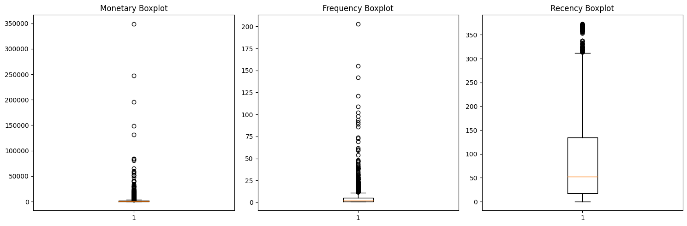
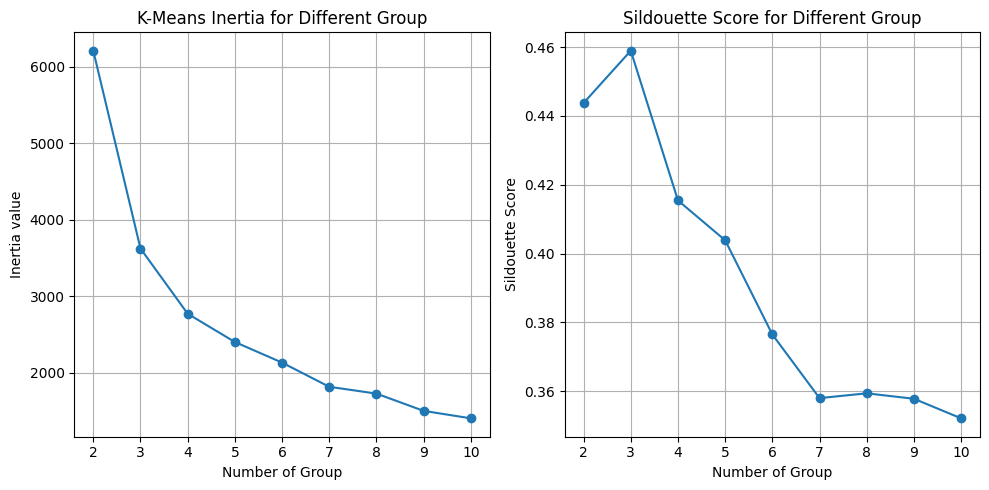
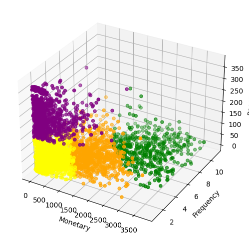
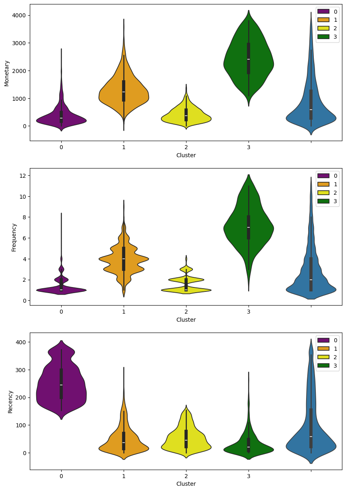
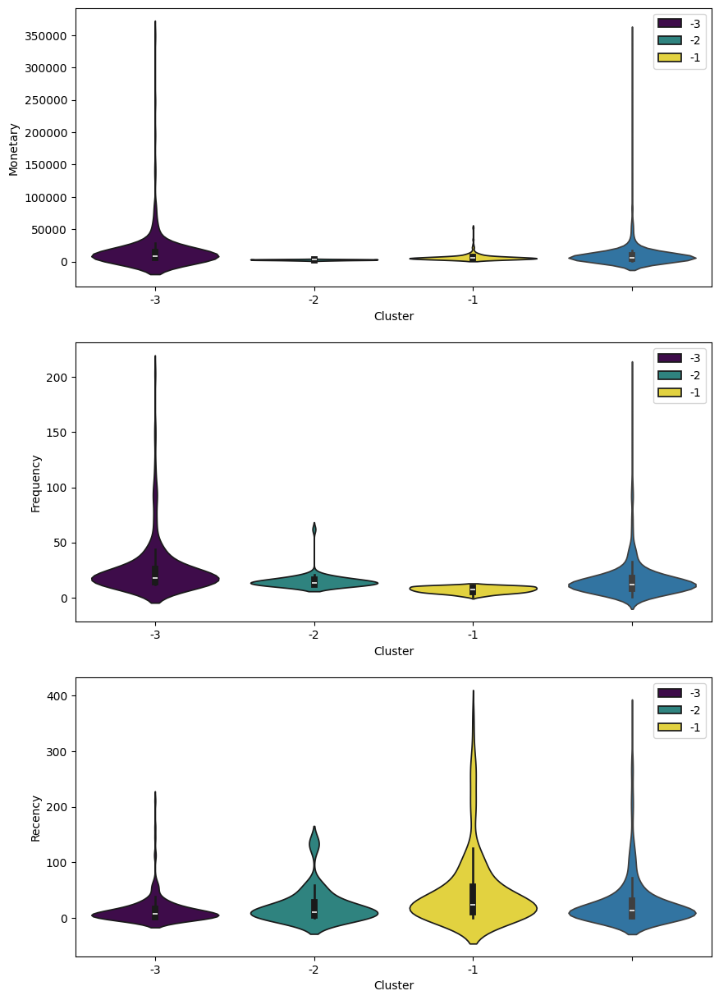
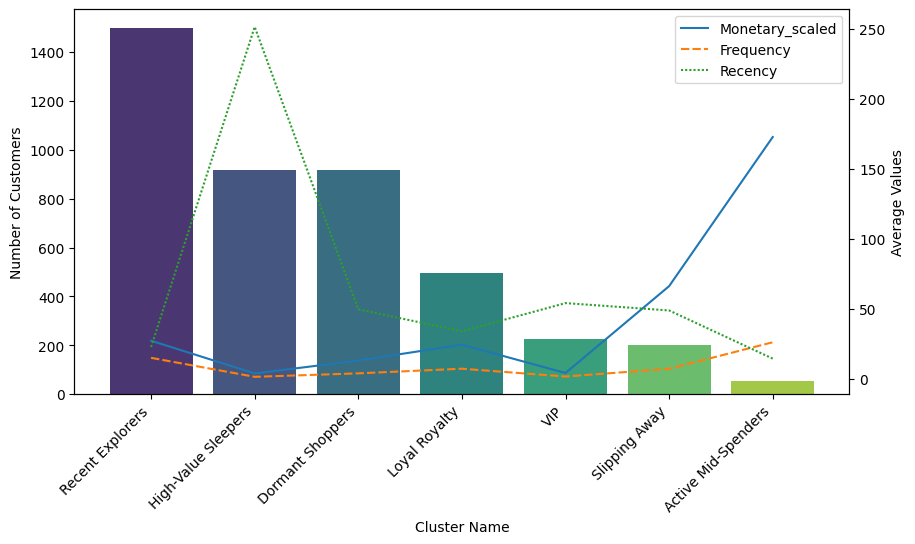

# Retail Customer Segmentation and Product Recommendation using RFM, K-Means, and Apriori"

This project focuses on segmenting retail customers through RFM analysis and K-Means clustering, followed by product recommendations using the Apriori algorithm. The goal is to identify distinct customer groups and provide personalized product suggestions, enabling more effective marketing and enhanced customer experience.

## Data Cleaning

- Removed ~33% of the dataset due to null or invalid values (e.g., negative Quantity and Price, missing Customer IDs).
- Investigated inconsistencies in `StockCode` and `Description`; assumed valid where no clear pattern violation occurred.
- Standardized variables due to varying scales before clustering.

## Clustering Approach

- Used K-Means clustering with standardization to segment customers.
- Seperate outliners into another dataset
- Evaluated optimal number of clusters using Elbow and Silhouette Score.
- Final model uses **7 clusters** based on performance.

Outliers in Monetary, Frequency, and Recency will be stored in a separate dataframe for further analysis. These outliers may represent important customer segments – especially high spenders and frequent shoppers – and should not be dropped.

Elbow and Sildouette Score metrics suggest 4 is the optimal number of clusters

Note: The scales of Monetary, Frequency, Recency differ. Since K-Means is sensitive to scale due to its reliance on distance metrics, we need to standardize the data to avoid bias toward high-scale features

## Cluster Summaries

### Final Cluster Insights (Removed Outliners)

| Cluster | Name                      | Recency      | Frequency   | Monetary    | Key Traits                                  |
|--------:|---------------------------|--------------|-------------|-------------|---------------------------------------------|
| 0      | **Dormant Shoppers**       | High         | Very Low    | Very Low    | Likely churned                              |
| 1      | **High-Value Sleepers**    | High         | High        | High        | Former VIPs at risk                         |
| 2      | **Recent Explorers**       | Very Low     | Low         | Low         | New or just returned                        |
| 3      | **Loyal Royalty**          | Very Low     | High        | High        | Most valuable                               |

### Outlier Segmentation
Created a separate analysis for high-value customer outliers:

| Cluster | Name                       | Recency      | Frequency   | Monetary    | Key Traits                                  |
|--------:|----------------------------|--------------|-------------|-------------|---------------------------------------------|
| -3      | **VIP**                    | Very recent  | Very high   | Very high   | Loyal, recent, high-value customers         |
| -2      | **Active Mid-Spenders**    | Recent       | Medium      | Medium      | Regular, moderate spenders                  |
| -1      | **Slipping Away**          | Very high    | Very low    | Very low    | At-risk or nearly churned                   |

### 🧪 Business Recommendations
- **Dormant Shoppers**: Winback campaigns, reactivation emails, or sunset them from marketing focus if unresponsive.
- **High-Value Sleepers**: Bring them back with personalized offers, exclusive sales, or reminders of past value.
- **Recent Explorers**: Build habits — introduce them to loyalty perks, onboarding content, and cross-sells.
- **Loyal Royalty**: VIP programs, early access, personalized appreciation — keep them feeling special and rewarded.
- **VIP**: Prioritize retention with loyalty perks, VIP access, and personalized rewards.
- **Active Mid-Spenders**: Encourage upsells and product bundles to increase AOV.
- **Slipping Away**: Reactivation campaigns with discounts and reminders.

## Product Recommendation
On progress

### Cited Credits
- Feature image: Corporate Vision  
https://www.corporatevision-news.com/5-customer-segmentation-analysis-methods-for-business-growth/
---
